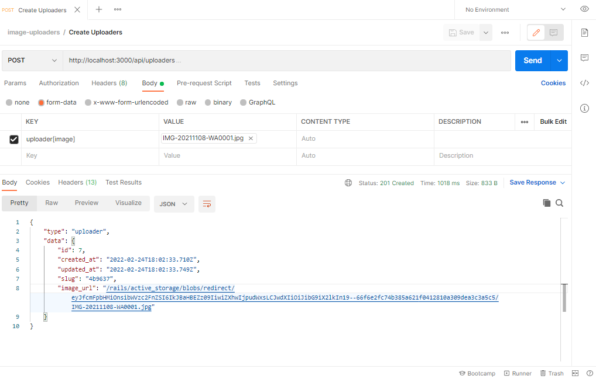

# Api de Uploader de Imagem

### Funcionalidadess:
- Fazer upload de images com active storage.

### Lista de Uploaders
```
GET /api/uploaders
```

```json
response body, status: 200

{
   "type": "uploader",
   "data": [{
        "id": 1,
        "created_at": "2022-02-20T01:56:09.854Z",
        "updated_at": "2022-02-20T01:56:09.871Z",
        "slug": "07917d",
        "image_url": "/rails/active_storage/blobs/redirect/eyJfcmFpbHMiOnsibWVzc2FnZSI6IkJBaHBDQT09IiwiZXhwIjpudWxsLCJwdXIiOiJibG9iX2lkIn19--81a83573466f3cad776b6b90a9c50a6484de7887/IMG-20211201-WA0009.jpg"
    }],
    "count": 1
}
```

### Detalhes do Uploader
```
GET /api/uploaders/:slug
```

```json
response body, status: 200

{
    "type": "uploader",
    "data": {
        "id": 7,
        "created_at": "2022-02-24T18:02:33.710Z",
        "updated_at": "2022-02-24T18:02:33.749Z",
        "slug": "4b9637",
        "image_url": "/rails/active_storage/blobs/redirect/eyJfcmFpbHMiOnsibWVzc2FnZSI6IkJBaHBEZz09IiwiZXhwIjpudWxsLCJwdXIiOiJibG9iX2lkIn19--66f6e2fc74b385a621f0412810a309dea3c3a5c5/IMG-20211108-WA0001.jpg"
    }
}
```

### Criar um Uploader
```
POST /api/uploaders
```



## Rodando o projeto:

Requisitos:
  - Ruby 3.0.2
  - Rails 6.1.4
  - Postgresql

Comandos:

### Clone em sua máquina

```shell
git clone https://github.com/beto-machado/Image-Uploaders-Api.git
```

### Instale as dependências
```shell
bundle install
```

### Crie o Banco de Dados
```shell
rails db:create db:migrate
```

### Execute a aplicação
```shell
rails s

